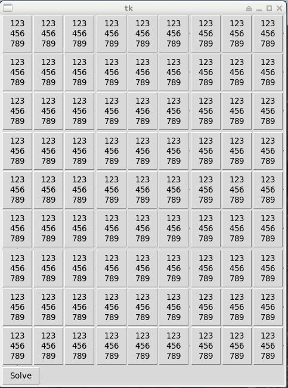
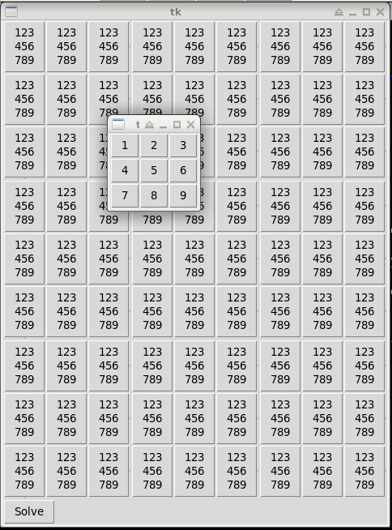
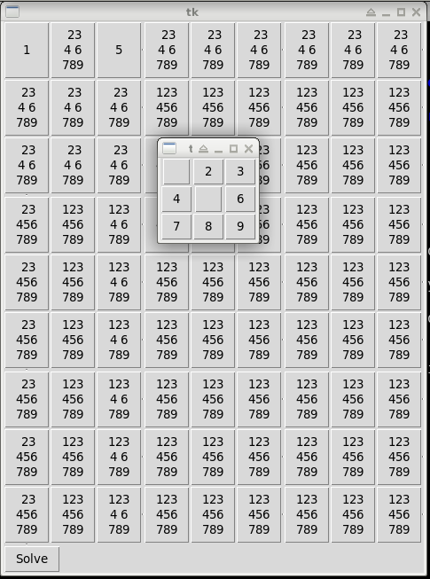
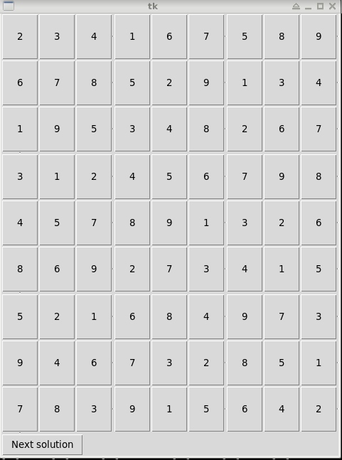

# sudosol

Sudoku solver with a simple GUI.

# Setup

There is no setup. Python3 is required to execute sudosol.

# Execution

Just call

    python3 gui.py

This will give you a blank sudoku board:

Each square show initially shows the numbers 1 through 9.
Clicking on one square, a new window will pop up allowing you to select one
of the numbers:

If the square does not allow some numbers, they won't be selectable:

Right after clicking, the selection window will close and the contents of all
other squares updated by removing all numbers that would violate the rules of
sudoku:

Click 'Solve' at the bottom and wait...
As soon as all solutions have been found (if you use a Sudoku posed within a
magazine or so there should only be ONE ) the board will be filled with the 
first solution and the 'Solve' button will turn into a 'Next solution' button.
Clicking it will present you another solution if one is available.

That's it.

# Background

The solver has been redesigned to filter out impossible solutions
as soon as a value of a field has been pinned down to one value.

Clicking 'Solve' will trigger a simple backtracking algorithm that searches
all possible combinations for valid solutions.

The backtracking solver works recursively.
If you are interested in it,  it should be fairly easy to understand, just
see `sudoku.Field.next_solution()`.

# Sudosol 1

Sudosol 1 does not have any kind of pre-filtering.
This old version is substancially slower and clumsy than the current one.

The old version with the iterative solver is still available underneath the tag
'1.0' in the source repo if you are interested.

It features an iterative implementation of the backtracking solver.
The iterative solver is, amazingly, slower than the recursive one ... oO

